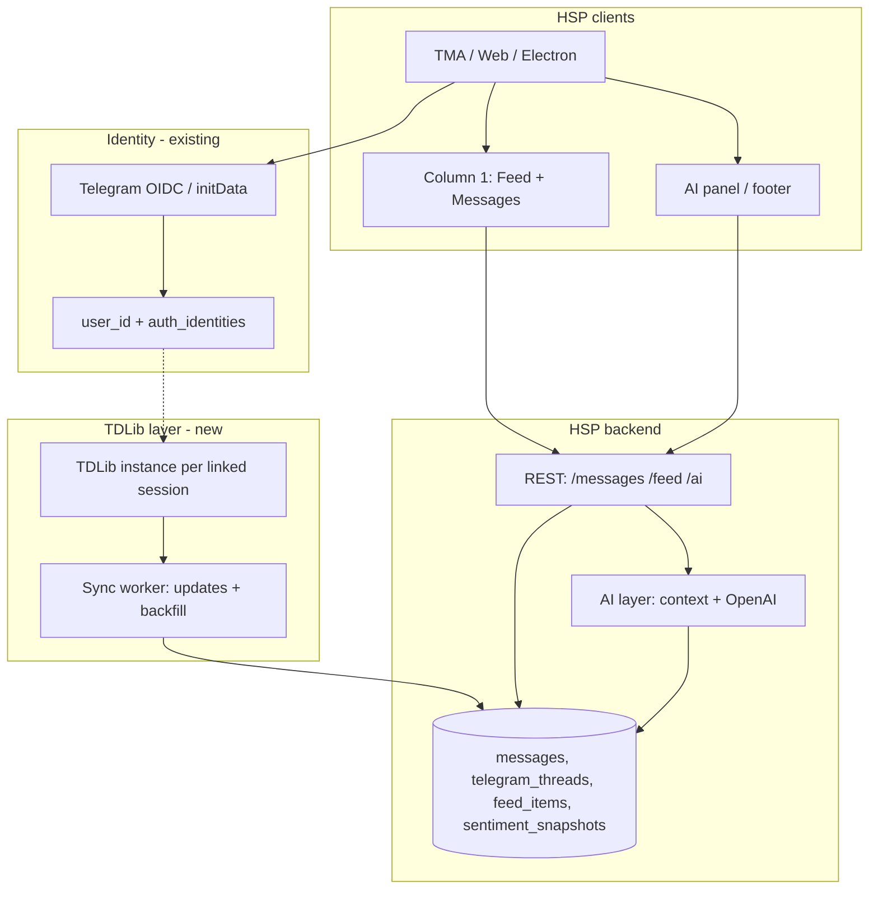
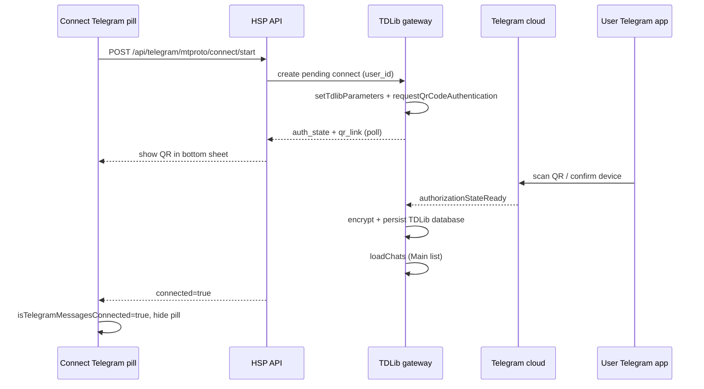

# TDLib: “Build your own Telegram”, Messages in Feed/Column 1, AI analysis, and public-group token sentiment

This document is a **research and implementation guide** for Hyperlinks Space Program (HSP). It covers:

1. What [TDLib](https://core.telegram.org/tdlib) is and how it fits next to the Bot API and Mini App `initData`.
2. How to show **Telegram-origin messages** in the **Feed** and **Messages** section of the **first column** (Smart / home layout).
3. How to run **AI analysis** on those messages in a way that matches HSP’s existing AI and DB plans.
4. Whether you can **parse all public Telegram group messages** to answer prompts like *“What tokens are people talking about now?”* — technically, legally, and practically.
5. How the existing **Connect Telegram** button should establish a TDLib session (one-tap plan) — §11.

**Related HSP docs:** [`login-and-telegram-messages-architecture.md`](login-and-telegram-messages-architecture.md), [`feed-messages-architecture.md`](feed-messages-architecture.md), [`database_messages.md`](database_messages.md), [`ai_bot_messages.md`](ai_bot_messages.md), [`trade-gift-marketplace-telegram-api.md`](trade-gift-marketplace-telegram-api.md), [`responsive-main-right-ai-layout.md`](responsive-main-right-ai-layout.md).

---

## 1) Three Telegram API layers (do not mix them)

Telegram exposes **three different stacks**. HSP already uses layers A in production; layers B/C are backlog (**TDLIB** in `short_term_backlog.md`).

| Layer | Auth | What you get | HSP today |
|-------|------|--------------|-----------|
| **A — Bot API + Mini App** | Bot token; TMA `initData` (verified server-side) | Bot-visible chats; verified **identity** only from TMA | Bot (`grammy`), OIDC, TMA login, feed API |
| **B — TDLib (recommended user client path)** | User session (`api_id` + `api_hash` + phone/QR/password) | Full **user** client: chats the user can access, `getChatHistory`, send, gifts (`payments.*`), etc. | Not wired (`TelegramMessagesConnectionContext` stub) |
| **C — Raw MTProto** | Same as B | Same capabilities as B; you implement encryption/sessions yourself | Not used |

Official overview: [TDLib on core.telegram.org](https://core.telegram.org/tdlib). Telegram’s blog post [TDLib – Build Your Own Telegram](https://telegram.org/blog/tdlib) describes TDLib as the path for **third-party clients** on Telegram’s cloud — network, encryption, and local storage included.

**Rule:** “Connect Telegram” for **login** (OIDC / `initData`) ≠ “Connect Telegram messages” (TDLib user session). Separate consents, storage, and revoke flows — same pattern as gift Trade in [`trade-gift-marketplace-telegram-api.md`](trade-gift-marketplace-telegram-api.md) §8.

**Implementation plan for the in-app button:** §11 (maps your existing **Connect Telegram** pill to TDLib so `loadChats` / `updateChatPosition` can run).

---

## 2) TDLib essentials (what you actually build)

### 2.1 What TDLib gives you

From [Getting started with TDLib](https://core.telegram.org/tdlib/getting-started):

- **Fully asynchronous** client: send requests, receive responses and **updates** in order.
- **Local database** (optional `use_message_database`) — encrypted cache of chats/messages on disk.
- **Authorization** driven by `updateAuthorizationState` (phone → code → optional 2FA → `authorizationStateReady`).
- **Chat types:** private, basic group (0–200, **no shared history for new members**), supergroup (shared history up to 200k members), channels (read-only for most members), secret chats (E2E, device-bound).

You need **`api_id` and `api_hash`** from [my.telegram.org](https://my.telegram.org/apps) when calling `setTdlibParameters`.

### 2.2 Core methods for messaging UX

| TDLib method | Use in HSP |
|--------------|------------|
| `loadChats` + `updateChatPosition` | Build chat list for **Messages** column — **only after** `authorizationStateReady` (§11) |
| `getChatHistory` | Paginate thread history (max ~100 per request; iterate `from_message_id`) — [docs](https://core.telegram.org/tdlib/docs/classtd_1_1td__api_1_1get_chat_history.html) |
| `updateNewMessage` | Real-time ingest for sync worker |
| `searchMessages` | Search across **user’s** chats (Main/Archive lists), not the whole internet — [docs](https://core.telegram.org/tdlib/docs/classtd_1_1td__api_1_1search_messages.html) |
| `searchPublicChats` | Find public supergroups/channels by title/username — [docs](https://core.telegram.org/tdlib/docs/classtd_1_1td__api_1_1search_public_chats.html) |
| `searchPublicMessagesByTag` | Public **channel posts** with a **hashtag or cashtag** (`$BTC`, `#crypto`) — [docs](https://core.telegram.org/tdlib/docs/classtd_1_1td__api_1_1search_public_messages_by_tag.html) |

**Not in TDLib:** `messages.searchGlobal` (MTProto global search). TDLib maintainer on [tdlib/td#2827](https://github.com/tdlib/td/issues/2827): even if you call raw MTProto, *“it will not help”* for a unified cross-chat feed without per-chat `getChatHistory` and manual merge.

### 2.3 Runtime placement (same options as gifts)

| Option | Messages UX | Fits HSP |
|--------|-------------|----------|
| **Server TDLib gateway** | One backend service; web/TMA/desktop call HSP API | Fastest unified UX; user trusts HSP with Telegram session |
| **Device TDLib** (Electron / mobile) | Session on device; sync excerpts to server only if user opts in | Aligns with non-custodial wallet story |
| **Hybrid** | Native local TDLib; web uses opt-in server gateway | Pragmatic for Windows app + browser |

TDLib bindings: official [examples](https://core.telegram.org/tdlib/getting-started) (Java, C#); community wrappers for Node (`tdl`, prebuilt `@prebuilt-tdlib/*`), Python, Go, etc. Electron/Windows app is a natural first target for on-device TDLib.

### 2.4 Operational risks

- **Flood waits / bans:** aggressive history backfill triggers rate limits; TDLib GitHub issues document accounts stalling after heavy `getChatHistory` loops ([tdlib/td#1530](https://github.com/tdlib/td/issues/1530)).
- **Session security:** TDLib DB + auth key = full account access; encrypt at rest, support revoke, never log session + message content together.
- **Updates:** TDLib version must track Telegram server changes; plan upgrade cadence.

---

## 3) Product mapping: Feed vs Messages in column 1

HSP’s left column (Smart / authenticated home) already separates concerns — see [`feed-messages-architecture.md`](feed-messages-architecture.md) and [`responsive-main-right-ai-layout.md`](responsive-main-right-ai-layout.md).

### 3.1 Messages (first column → Messages tab)

**Purpose:** persistent **conversation threads** — full history, open thread, reply (if product allows).

| UI | Data source | Notes |
|----|-------------|-------|
| Thread list | TDLib `loadChats` → normalized `telegram_threads` | Sort by `chat.positions` / last message time |
| Thread detail | `getChatHistory` + `updateNewMessage` | Paginate; show `formattedText` + entities |
| Connection pill | `TelegramMessagesConnectionContext` | Today stub `isTelegramMessagesConnected: false`; set true after TDLib `authorizationStateReady` |

Persist in HSP DB (extend [`database_messages.md`](database_messages.md)):

- `telegram_chat_id`, `telegram_message_id`, `user_id`, `thread_id` (internal), `role`, `content`, `sent_at`, `source = 'telegram_tdlib'`.
- Keep **Bot** threads separate (`type = 'bot'`) from **Telegram sync** (`type = 'telegram'`) from **in-app AI** (`type = 'app'`).

### 3.2 Feed (first column → Feed tab)

**Purpose:** **cards** and digests — not a duplicate of full chat lines. See [`feed-messages-architecture.md`](feed-messages-architecture.md) §1.

Telegram-driven feed cards:

| `source_type` / `card_type` | Example |
|-----------------------------|---------|
| `message_preview` | “New in @AlphaCalls: …” with deep link to Messages thread |
| `ai_digest` | “From your messages” — weekly summary |
| `ai_digest` + market | “Tokens mentioned in your watched channels” |

Feed rows reference Messages via `payload.thread_id` / `payload.telegram_chat_id`; **do not** store full chat history only in `feed_items`.

### 3.3 AI column (ultra layout / footer)

Backlog line 18: *“What tokens are people talking about today?”* — this is **AI over aggregated or consented corpora**, not raw TDLib in the browser. Flow:

1. User prompt in AI bar ([`ai_and_search_bar_input.md`](ai_and_search_bar_input.md)).
2. Backend selects **allowed context** (user’s synced messages, bot thread, precomputed sentiment snapshot).
3. Model responds; optional assistant row in `messages` (`type = 'app'`).

---

## 4) End-to-end architecture (recommended)



### 4.1 Phased implementation

| Phase | Scope | Delivers |
|-------|--------|----------|
| **0** | Bot path (existing plan) | User ↔ bot messages in `messages`; AI in bot layer — [`ai_bot_messages.md`](ai_bot_messages.md) |
| **1** | Read-only TDLib spike | One test account: `loadChats`, `getChatHistory`, `updateNewMessage` → Postgres |
| **2** | Messages UI | Column 1 **Messages** tab lists synced threads; thread detail from HSP API (not TDLib from browser) |
| **3** | Feed linkage | `message_preview` and `ai_digest` cards from synced data |
| **4** | AI on consented corpus | Thread summaries, “analyze this chat”, Q&A over `getThreadHistory` |
| **5** | Watchlist sentiment | Curated public channels + `searchPublicMessagesByTag` + aggregates (§6) |
| **6** | Optional device-local TDLib | Windows/Electron session without server custody |

**UI gate:** `FloatingShield` / `TelegramConnectFooterStrip` already hide “connect messages” affordances when `isTelegramMessagesConnected` — wire this to real TDLib session state (full plan in §11).

---

## 5) AI analysis on Telegram messages (compliant patterns)

### 5.1 What Telegram’s terms allow (2024–2026)

Telegram’s policies are **restrictive** for broad scraping + AI. Sources:

- [Terms of Service for Content Licensing](https://telegram.org/tos/content-licensing): prohibits scraping/indexing/harvesting for **AI/ML training**; limited exception for legitimate clients/bots **strictly required** to operate the service.
- [Telegram API Terms of Service](https://core.telegram.org/api/terms) §1.5: same prohibition on using platform data to train/fine-tune AI.
- [Bot Platform Developer Terms](https://telegram.org/tos/bot-developers) §4.3: explicitly forbids using TPAs to scrape **public group or channel contents** to build large datasets or ML products.

**Implication for HSP:** Product features must be framed as **ordinary client functionality** with **explicit, revocable user consent** for the **specific chats/content** analyzed — not silent harvest of “all Telegram.”

### 5.2 Allowed AI feature shapes

| Feature | Data | Consent | ToS alignment |
|---------|------|---------|----------------|
| Summarize **my** Telegram chats | User’s TDLib sync or bot DM | “Analyze my Telegram messages” toggle | User-volunteered data to your client |
| Q&A on **one** thread user opened | That thread’s rows in your DB | Implicit for opened thread + settings | Scoped context window |
| Bot assistant in **your** bot chat | Bot API updates you already receive | Bot privacy policy | Standard bot product |
| **Market pulse** from **curated** public channels | Watchlist + tag search + aggregates | Disclose sources; no claim of “all Telegram” | Analytics on **selected** public posts; avoid bulk archival |
| Global “every public group” miner | Entire platform | Not obtainable at scale | **Conflicts** with Content Licensing / Bot Developer terms |

### 5.3 Technical AI pipeline (reuse HSP stack)

Align with [`ai_bot_messages.md`](ai_bot_messages.md):

1. **Ingest** → normalize text (strip entities, keep cashtags).
2. **Store** → `messages` + optional `message_entities` (tickers, URLs).
3. **Retrieve** → `getThreadHistory` or retrieval over watchlist corpus.
4. **Analyze** → `transmit` / `transmitStream` with bounded context; for digests, **precompute** summaries into `feed_items` (`source_type = ai_digest`).
5. **Entity extraction** for tokens: regex cashtags (`$[A-Z]{2,10}`), known symbol list, optional NER — run in worker, store **counts** in `sentiment_snapshots` rather than re-sending raw firehose to the model.

---

## 6) “What tokens are people talking about now?” — feasibility

### 6.1 Short answer

| Question | Answer |
|----------|--------|
| Can the **Bot API** read all public groups? | **No.** Bots only see chats where the bot is a member; no on-demand history for arbitrary public groups ([Bot API limitations](https://core.telegram.org/bots/api) — no `getHistory` for channels). |
| Can **TDLib as a user** read any public group? | **Public channels:** often readable by username without joining. **Public supergroups:** usually must **join**; then shared history is visible (unless hidden for new members). **Basic groups:** not reliably accessible without membership; new members may not see old messages ([TDLib getting started — chat types](https://core.telegram.org/tdlib/getting-started)). |
| Can you parse **literally all** public Telegram messages? | **Not practically or permissibly** as an HSP product: no global firehose API; `searchGlobal` not exposed in TDLib and not a full substitute; rate limits; ToS prohibits platform-scale scraping for AI datasets. |
| Can you build a **useful** “tokens people talk about” feature? | **Yes**, with a **curated watchlist** + **tag search** + **aggregation**, clearly labeled (“Based on N channels you follow / we track”). |

### 6.2 Three technical strategies (increasing ambition)

#### Strategy A — User-scoped (safest, MVP)

- TDLib syncs **user’s** chats only.
- Worker extracts cashtags from new messages; daily rollup: top symbols per user.
- AI prompt: “What tokens appeared in **your** Telegram this week?”
- Feed card: `ai_digest` with `payload.tokens: [{symbol, count}]`.

#### Strategy B — Curated market watchlist (product “pulse”)

1. Maintain `watched_public_chats` (channel usernames, internal IDs).
2. Service account or dedicated TDLib user **joins** those channels/groups (respecting join rules).
3. For each symbol in a configurable list (or top coins), call `searchPublicMessagesByTag` with `$SYMBOL` / `#SYMBOL`.
4. Store **aggregates only** (mention count, velocity, sample links) in `sentiment_snapshots`; refresh on schedule (e.g. every 15–60 min).
5. AI reads **snapshot + small samples**, not full archive.
6. UI: Smart AI default prompt + Feed highlight card.

**Limits:** `searchPublicMessagesByTag` targets **public channel posts**, not every supergroup message; cashtags must appear in text; Telegram may cap result counts.

#### Strategy C — Per-chat backfill (heavy)

- For each watched chat: loop `getChatHistory` until exhausted.
- Merge timelines manually (TDLib maintainer guidance for multi-chat feeds).
- **Cost:** slow, flood-prone, storage-heavy; only for **small** watchlists with backoff.

**Do not** plan Strategy C across “all public Telegram.”

### 6.3 What you cannot rely on

- **Global search across all public channels** via official TDLib — not available as `searchGlobal`; maintainer closed issue stating it won’t solve unified feeds ([tdlib/td#2827](https://github.com/tdlib/td/issues/2827)).
- **Third-party “read any public channel” APIs** — often violate the same Telegram terms; legal/reputational risk if used as core dependency.
- **Web preview scraping** (`t.me/s/...`) — brittle, incomplete, and still scraping.

### 6.4 Suggested schema for token pulse

```text
watched_public_chats
  id, telegram_chat_id, username, title, joined_at, active

sentiment_snapshots
  id, window_start, window_end, symbol, mention_count, velocity_score,
  sample_message_ids (json), source_chat_ids (json), created_at

feed_items
  source_type = 'ai_digest', card_type = 'user_status' or custom 'market_pulse',
  payload: { title, tokens: [...], disclaimer: "Based on watched channels, not all of Telegram" }
```

---

## 7) Security, privacy, and UX checklist

1. **Two connections:** Login (OIDC) vs Messages (TDLib) — separate UI, DB tables, revoke.
2. **Encryption:** TDLib `database_directory` encrypted; server-side `telegram_mtproto_sessions` encrypted at rest.
3. **Retention:** TTL on raw message copies; keep aggregates longer if policy allows.
4. **Deletion:** user “Disconnect Telegram messages” wipes sync tables + TDLib session + feed cards sourced from Telegram.
5. **Transparency:** Settings show which chats are synced and which watchlist channels drive “market pulse.”
6. **Disclaimer** on AI answers: scope of data (user chats vs watchlist vs bot only).
7. **No secret chats** in server sync unless explicit E2E product decision (`use_secret_chats` off by default on server).

---

## 8) Comparison table (Bot vs TDLib for HSP goals)

| Goal | Bot API | TDLib user session |
|------|---------|-------------------|
| Show user DMs with **your bot** in Messages | Yes | Yes (if user has that chat) |
| Show **all** user DMs / private groups | No | Yes (user-accessible) |
| Read **arbitrary** public channel without joining | No | Partial (channels often yes; groups usually need join) |
| Real-time updates | Webhook/getUpdates | `updateNewMessage` |
| “All public groups” token scan | No | No (not complete + ToS) |
| Curated channel cashtag pulse | No | Yes (`searchPublicMessagesByTag`) |
| Gift / Stars Trade | No | Yes (`payments.*`) |
| Works in browser without user session | Yes (bot only) | No (need native or server session) |

---

## 9) FAQ (decision summary)

| Question | Answer |
|----------|--------|
| Should HSP use TDLib? | **Yes** if product needs real Telegram inbox, gifts Trade, or public-channel tag search — **not** if bot-only MVP is enough. |
| Feed vs Messages? | **Messages** = threads; **Feed** = cards/digests referencing them — [`feed-messages-architecture.md`](feed-messages-architecture.md). |
| First column wiring? | `AuthenticatedHomeLeftNavStrip` Feed/Messages tabs → API-backed panels; `isTelegramMessagesConnected` gates connect UX. |
| AI on messages? | Central AI layer loads `getThreadHistory`; user consent per scope; precomputed digests for Feed. |
| Parse all public groups for tokens? | **Not** as a compliant global product; use **watchlist + tag search + user-scoped** analysis instead. |
| Legal for AI training on scraped groups? | **Prohibited** by [Content Licensing terms](https://telegram.org/tos/content-licensing); build **feature-time inference** on consented/scoped data, not platform-scale training sets. |
| How does **Connect Telegram** unlock TDLib? | One tap starts **MTProto** login (QR-first); persisted session → `loadChats` on gateway — §11. |

---

## 11) “Connect Telegram” button → TDLib session (one-click plan)

This section maps the **existing UI** to TDLib so methods like `loadChats` work, and defines a **one-tap** connect flow as far as Telegram allows.

### 11.1 What HSP has today (repo state)

| Piece | Location | Status |
|-------|----------|--------|
| **Connect Telegram** pill (narrow home footer) | `ui/components/TelegramConnectFooterStrip.tsx` — label `home.mainColumnFooter.telegramMessages` (“Connect Telegram”) | Rendered from `app/_layout.tsx`; **`onConnectPress` is not wired** (no handler passed) |
| Connection flag | `ui/telegram/TelegramMessagesConnectionContext.tsx` | Stub: `isTelegramMessagesConnected: false` always |
| Hide floating shield when disconnected | `ui/components/FloatingShield.tsx` | Shows `TelegramConnectFooterStrip` instead when not connected |
| **Sign in with Telegram** (Welcome) | `ui/components/WelcomeAuthButtons.tsx` → `POST /api/auth/telegram/start` | **OIDC identity only** — [`telegram-login-outside-telegram.md`](telegram-login-outside-telegram.md) |
| TMA instant identity | `ui/components/Telegram.tsx` + `initData` | Mini App login, **not** TDLib |
| App session cookie | `hs_auth_session` + `database/telegramAuth.ts` | HSP account, not MTProto |

**Product intent:** The footer pill should mean **“Connect Telegram messages”** (TDLib), not repeat Welcome OIDC. If the user is not signed into HSP yet, the same tap can **chain** OIDC first, then MTProto — but the MTProto step is still required for `loadChats`.

### 11.2 Two different “connections” (do not merge)

| Connection | Proves | Unlocks | HSP storage |
|------------|--------|---------|-------------|
| **A — App identity** | OIDC `id_token` or TMA `initData` | HSP `user_id`, wallet, feed, settings | `auth_sessions`, `auth_identities` |
| **B — Telegram client session (TDLib)** | MTProto auth (QR / code / 2FA) | `loadChats`, `getChatHistory`, `payments.*`, tag search | `telegram_mtproto_sessions` + encrypted TDLib DB |

OIDC **does not** issue an MTProto session. There is no Telegram API to “upgrade” OIDC into TDLib without the user completing **client authorization** ([Getting started — User authorization](https://core.telegram.org/tdlib/getting-started)).

### 11.3 What “one click” can mean (honest UX)

True **zero-step** access to `loadChats` without any Telegram authorization step is **not possible** — Telegram requires an explicit MTProto login (QR confirm, SMS/app code, or 2FA password).

What you **can** ship as **one tap from HSP**:

| Visit | User action | Behind the scenes |
|-------|-------------|-------------------|
| **First connect** | Tap **Connect Telegram** once | Open connect sheet → show **QR** (or phone fallback) → user confirms in official Telegram app → `authorizationStateReady` → start sync |
| **Return visit** (session valid) | No pill (already connected) | Gateway loads encrypted TDLib DB → auto `authorizationStateReady` → `loadChats` |
| **Session expired** | Tap **Connect Telegram** once | Same sheet; QR again (or password if 2FA) |

**Best one-tap path:** **QR login** via TDLib [`requestQrCodeAuthentication`](https://core.telegram.org/tdlib/docs/classtd_1_1td__api_1_1request_qr_code_authentication.html) when state is `authorizationStateWaitPhoneNumber`. TDLib moves to [`authorizationStateWaitOtherDeviceConfirmation`](https://core.telegram.org/tdlib/docs/classtd_1_1td__api_1_1authorization_state_wait_other_device_confirmation.html) with a `tg://` link → render as QR. User scans with Telegram on phone (often the **same phone** — open Telegram → Settings → Devices → Scan QR).

**Phone + SMS:** Third-party apps generally **cannot** rely on SMS codes ([tdlib/td#2310](https://github.com/tdlib/td/issues/2310)); codes arrive via **Telegram app** (`authenticationCodeTypeTelegramMessage`) or Fragment. **New Telegram users** must register in an **official mobile app first** before third-party TDLib login works.

**Inside TMA:** User is already in Telegram — QR flow is still the most reliable MTProto path (no special “free pass” from `initData` to `loadChats`).

### 11.4 Recommended architecture for one-click web + TMA

Use a **server TDLib gateway** for browser and TMA first (reuse OAuth window pattern from Welcome). Windows/Electron can move to **device TDLib** later (hybrid §2.3).



**Prerequisites (ops):**

1. Register app at [my.telegram.org/apps](https://my.telegram.org/apps) → `TELEGRAM_API_ID`, `TELEGRAM_API_HASH` (server env only).
2. TDLib gateway process (Node `tdl` + prebuilt binary, or sidecar) with writable `database_directory` per user.
3. Encrypt TDLib files at rest (app-level key from env/KMS); tie directory to `telegram_username` / `user_id`.

### 11.5 New backend: routes and handlers

Add alongside existing `api/auth/telegram/*` (identity). Suggested surface:

| Route | Purpose |
|-------|---------|
| `POST /api/telegram/mtproto/connect/start` | Requires HSP session; allocates connect `attempt_id`; initializes TDLib; returns `{ attemptId, authState, qrLink? }` |
| `GET /api/telegram/mtproto/connect/status?attemptId=` | Poll: `wait_qr`, `wait_password`, `ready`, `failed` |
| `POST /api/telegram/mtproto/connect/password` | Body `{ attemptId, password }` when `authorizationStateWaitPassword` |
| `POST /api/telegram/mtproto/disconnect` | Wipe session row + TDLib files; revoke sync |
| `GET /api/telegram/mtproto/status` | `{ connected, telegramUserId?, connectedAt? }` for `TelegramMessagesConnectionContext` |
| `GET /api/telegram/chats` | Normalized chat list from gateway (`loadChats` + cached `updateChatPosition`) |
| `GET /api/telegram/chats/:chatId/messages` | Paginated `getChatHistory` |

Handlers: `api/_handlers/telegram-mtproto-*.ts` + thin `api/telegram/mtproto/*.ts` exports (same pattern as `auth/telegram/start.ts`).

**Session extension on `GET /api/auth/session`:** optional `telegram_messages_connected: boolean` so one bootstrap call hydrates both app auth and MTProto status.

### 11.6 New database: `telegram_mtproto_sessions`

Separate from `auth_sessions` (HSP cookie):

```text
telegram_mtproto_sessions
  id (uuid PK)
  telegram_username (FK → users, unique)
  provider_subject (telegram user id string, from TDLib getMe)
  status ('connecting' | 'active' | 'revoked' | 'error')
  tdlib_db_path_encrypted_ref   -- pointer to encrypted blob or path
  device_model, system_language  -- setTdlibParameters metadata
  connected_at, last_sync_at, revoked_at
  error_code (nullable)
```

Link row creation to successful `authorizationStateReady`. **Never** store QR links or 2FA passwords in Postgres — only ephemeral in gateway memory for the active attempt.

### 11.7 TDLib gateway: connect handler (minimal pseudocode)

After `authorizationStateReady`:

1. `getMe` → verify Telegram user matches `auth_identities` for `provider=telegram` when possible (warn if mismatch; offer “link accounts”).
2. `loadChats` with `chat_list = main` until `loadChats` returns `@type chatListMain` empty or limit reached.
3. Subscribe to `updateChatPosition`, `updateNewChat`, `updateNewMessage` → sync worker writes `telegram_threads` + `messages`.
4. Mark `telegram_mtproto_sessions.status = 'active'`.

`loadChats` loop (from [Getting started — Getting chat messages](https://core.telegram.org/tdlib/getting-started)):

- Call `loadChats` with `limit` until TDLib returns fewer chats than requested.
- Maintain in-memory / DB cache updated by `updateChatPosition`; **Messages column reads HSP API**, not TDLib directly from React.

### 11.8 Client plan: wire the existing button

#### Step 1 — Shared connect action

Create `ui/telegram/connectTelegramMessages.ts` (or hook `useConnectTelegramMessages`):

```ts
// Behavioral contract
async function connectTelegramMessages(): Promise<void> {
  // 1. If !isAuthenticated → run existing Welcome OIDC start (telegram) first, return to home
  // 2. POST /api/telegram/mtproto/connect/start
  // 3. Open TelegramConnectSheet (QR + status polling)
  // 4. On ready: refresh TelegramMessagesConnectionContext + optional initial /api/telegram/chats fetch
}
```

Reuse `navigateExternalAuthUrl` / `windows/oauth-window.cjs` **only** for step 1 (OIDC). MTProto connect stays **in-app sheet** (QR), not a full-page redirect.

#### Step 2 — `TelegramMessagesConnectionProvider`

- On mount (when `isAuthenticated`): `GET /api/telegram/mtproto/status`.
- Set `isTelegramMessagesConnected` from response.
- Expose `connect()`, `disconnect()`, `refreshStatus()`.

#### Step 3 — Wire `TelegramConnectFooterStrip`

In `app/_layout.tsx` (or a small wrapper):

```tsx
<TelegramConnectFooterStrip onConnectPress={() => connectTelegramMessages()} />
```

#### Step 4 — `TelegramConnectSheet` UI

- Title: “Connect Telegram messages”
- Short consent: sync chats for Feed/Messages/AI; revoke in Settings.
- **QR** from `qrLink` (refresh on poll while `wait_other_device_confirmation`).
- Fallback: “Log in with phone” → `setAuthenticationPhoneNumber` path (gateway-driven).
- 2FA password field when `wait_password`.
- Spinner until `ready`; then auto-close.

#### Step 5 — Messages column

- When connected: `GET /api/telegram/chats` → thread list (replaces empty state).
- Selecting thread: `GET /api/telegram/chats/:id/messages`.

### 11.9 Per-surface behavior

| Surface | One-tap connect flow |
|---------|----------------------|
| **Browser** (authenticated home) | Tap pill → in-app QR sheet → poll status |
| **TMA** | Same sheet; optional `Telegram.WebApp.openLink` helper text (“Open Telegram to scan”) — `initData` already identifies user but MTProto still required |
| **Windows / Electron** | Phase 1: same server gateway + QR in app window. Phase 2: local TDLib + export session or local QR |
| **Welcome (not signed in)** | Tap pill on welcome if shown → chain Welcome Telegram OIDC → redirect home → auto-open connect sheet (optional `?telegramConnect=1` query) |

### 11.10 Implementation order (checklist)

| # | Task | Files / notes |
|---|------|----------------|
| 1 | Env: `TELEGRAM_API_ID`, `TELEGRAM_API_HASH`, gateway paths | `.env.example` |
| 2 | Migration: `telegram_mtproto_sessions`, `telegram_threads` | `database/start.ts` |
| 3 | TDLib gateway module (spawn or in-process) | `telegram/tdlibGateway.ts` (new) |
| 4 | `connect/start`, `connect/status`, `disconnect`, `mtproto/status` handlers | `api/_handlers/telegram-mtproto-*.ts` |
| 5 | QR auth: `requestQrCodeAuthentication` + poll `updateAuthorizationState` | gateway |
| 6 | On ready: `loadChats` + persist session row | gateway + `database/telegramMtproto.ts` |
| 7 | `GET /api/telegram/chats` | handler + normalization |
| 8 | `TelegramMessagesConnectionProvider` real status | `ui/telegram/TelegramMessagesConnectionContext.tsx` |
| 9 | `TelegramConnectSheet` + `connectTelegramMessages()` | new UI components |
| 10 | Wire `onConnectPress` on strip | `app/_layout.tsx` |
| 11 | Extend `GET /api/auth/session` with `telegram_messages_connected` | `api/_handlers/auth-session.ts` |
| 12 | Messages column UI consumes `/api/telegram/chats` | authenticated home panels |
| 13 | Sync worker: `updateNewMessage` → `messages` table | worker / gateway |
| 14 | Settings: Disconnect Telegram messages | shield / settings |

**Spike gate (before UI):** Step 1–6 with a CLI or single API call proving `loadChats` returns chats after QR login.

### 11.11 After connect: `loadChats` → Messages column

| TDLib event / method | HSP action |
|----------------------|------------|
| `loadChats` (initial) | Fill `telegram_threads` cache; API list for UI |
| `updateChatPosition` | Re-sort thread list; bump `last_activity_at` |
| `updateNewChat` | Insert thread row |
| `updateChatLastMessage` | Update preview text on thread |
| `updateNewMessage` | Insert `messages` row; optional `feed_items` `message_preview` |
| User opens thread | `getChatHistory` backfill if cache incomplete |

The **Connect Telegram** pill hides when `isTelegramMessagesConnected === true` (existing `TelegramConnectFooterStrip` + `FloatingShield` logic). No new chrome required — only real status + `onConnectPress`.

### 11.12 Consent copy (for the connect sheet)

Suggested one-screen text:

- **What:** “Read your Telegram chats in Hyperlinks Messages and Feed.”
- **How:** “We use Telegram’s official client API (TDLib). You confirm login with Telegram on your phone.”
- **Not:** “We do not replace Telegram login for your Hyperlinks account unless you also sign in separately.”
- **Revoke:** “Disconnect anytime in Settings — removes our copy and session.”

Align with §7 and [`trade-gift-marketplace-telegram-api.md`](trade-gift-marketplace-telegram-api.md) §8 (separate consents).

### 11.13 If you already “logged in with Telegram” — do you connect twice?

**Yes, at the API level — but it should not feel like two unrelated products.**

| Step | What user did | What it unlocks | Enough for `loadChats`? |
|------|----------------|-----------------|-------------------------|
| **1 — App identity** | Welcome **Sign in with Telegram** (OIDC), or TMA `initData`, or Google then link | HSP session (`hs_auth_session`), wallet, feed | **No** |
| **2 — Client session** | **Connect Telegram** pill → TDLib QR (§11) | MTProto user session → `loadChats`, `getChatHistory` | **Yes** |

OIDC proves *who you are* to Hyperlinks. TDLib proves *your Telegram client session* to Telegram’s cloud. Telegram does not hand MTProto credentials to OIDC — there is no single token for both ([Getting started — User authorization](https://core.telegram.org/tdlib/getting-started)).

**UX goal (one product flow, not two apps):**

- After **step 1** succeeds, optionally **auto-open** the connect sheet for step 2 (same visit): *“Telegram account linked — confirm access to messages.”*
- If step 1 was **TMA `initData`**, step 2 is still required for inbox sync, but user already trusts Telegram — QR is usually fast.
- Label clearly: **Sign in** (account) vs **Connect messages** (sync) until you merge them in one guided flow.
- **Return visits:** only step 2 persistence matters for Messages; step 1 is the HSP cookie / TMA session.

You are **not** “logging into Telegram twice” in the OIDC sense — you are completing **identity** once and **client authorization** once. Merge them in UI so the pill after Welcome Telegram sign-in becomes step 2 of the same wizard, not a confusing second login.

### 11.14 Electron desktop: Telegram OIDC works in browser but fails in the app

This is **mostly an Electron + `app://` shell issue**, not a requirement that “you must use a website instead of a desktop app.” Telegram OIDC **must** use an **https** `redirect_uri` registered in @BotFather Web Login ([`telegram-login-outside-telegram.md`](telegram-login-outside-telegram.md)) — that is correct for both browser and Electron. The desktop UI can stay `app://`; the **callback stays on your API host** (e.g. `https://hsbexpo.vercel.app/api/auth/telegram/callback`).

#### What HSP does today

| Piece | Behavior |
|-------|----------|
| Desktop shell | UI at `app://` ([`api/_base.ts`](../../api/_base.ts) `isHttpPageOrigin`) |
| API calls | `EXPO_PUBLIC_API_BASE_URL` → deployed host (e.g. Vercel) |
| OAuth | [`windows/oauth-window.cjs`](../../windows/oauth-window.cjs) modal, **shared Electron session** with parent |
| Session | `hs_auth_session` **HttpOnly** cookie, **SameSite=Lax** ([`auth-telegram-callback.ts`](../../api/_handlers/auth-telegram-callback.ts)) |
| After OAuth | [`WelcomeContent.tsx`](../../ui/components/WelcomeContent.tsx) `fetch(/api/auth/session, { credentials: 'include' })` |

#### Why browser works but Electron often fails

1. **Cross-site cookies (most common)**  
   - Browser on `https://your-domain` → API on same site (or same-site `localhost`) → `credentials: 'include'` sends `hs_auth_session`.  
   - Electron main window is `app://` → API is `https://…` → **different site**. `SameSite=Lax` cookies are **not** sent on that cross-site `fetch`, even though the OAuth child window **did** set the cookie on the API domain.  
   - Result: Telegram OAuth **succeeds** in the modal, modal closes, but session probe returns `authenticated: false` → feels like “login failed.”

2. **Telegram / BotFather config (if OAuth modal shows an error)**  
   - Redirect URI in @BotFather must **exactly** match `https://<api-host>/api/auth/telegram/callback`.  
   - `TELEGRAM_CLIENT_ID` + `TELEGRAM_CLIENT_SECRET` must be set on the **API** deployment (callback returns `oidc_not_configured` if missing).

3. **User-visible error in modal**  
   - Check `hsp-oauth-complete` event `detail.error` or URL `telegramAuthError` (`state_not_found`, `invalid_nonce`, etc.).  
   - [`WelcomeContent`](../../ui/components/WelcomeContent.tsx) OAuth error handler currently shows **Google** alert title for desktop OAuth errors — fix when debugging.

**This is not “Telegram only allows websites.”** Desktop apps use the same https redirect pattern; they need a **session bridge** from the OAuth window to the `app://` shell.

#### Recommended fix for Electron (session bridge)

**Option A — Cookie handoff via Electron (preferred for current architecture)**

1. In `oauth-window.cjs`, when navigation hits success `https://<api>/` (no `telegramAuthError`), before closing:
   - `session.cookies.get({ url: apiOrigin, name: 'hs_auth_session' })`
   - Pass token in `hsp-oauth-complete` detail: `{ success: true, sessionToken }` (IPC only, not in URL).
2. In main/preload, store token in memory (or `safeStorage`).
3. Desktop API client: attach `Authorization: Bearer <token>` or custom header on `fetch` to `EXPO_PUBLIC_API_BASE_URL`.
4. Extend `GET /api/auth/session` (and other auth routes) to accept **cookie OR** validated bearer token (hash → `auth_sessions` lookup, same as cookie).

**Option B — `SameSite=None; Secure` cookie**

- Set session cookie with `SameSite=None; Secure` for desktop OAuth completion only.  
- May still hit third-party cookie restrictions; less reliable than Option A in Electron.

**Option C — Load UI from https in Electron**

- `mainWindow.loadURL('https://hsbexpo.vercel.app')` instead of `app://` bundle.  
- Same-origin as API → cookies work like browser.  
- Tradeoff: online-dependent UI shell; offline bundle story changes.

**Option D — Custom protocol redirect**

- Register `hsp://auth/callback` in Electron; callback handler redirects there with one-time code; app exchanges code for session.  
- More moving parts; similar to Option A.

#### After Electron OIDC works: Connect Telegram pill

Desktop **Sign in with Telegram** (OIDC) still does **not** replace **Connect Telegram** (TDLib). Fix OIDC first so users reach authenticated home; then pill → QR sheet (§11) for `loadChats`.

#### Quick diagnosis checklist

| Symptom | Likely cause |
|---------|----------------|
| OAuth window closes, still on Welcome | Cross-site cookie (`app://` + `credentials: include`) — §11.14 Option A |
| Modal shows Telegram error page | BotFather redirect URI / client id |
| Redirect with `telegramAuthError=oidc_not_configured` | Missing `TELEGRAM_CLIENT_SECRET` on API host |
| `telegramAuthError=state_not_found` | Rare if DB attempt row exists; check `auth_login_attempts` + serverless |
| Works on `https://` site, fails only in packaged app | Confirms `app://` cookie issue |

---

## 12) References

- [TDLib overview](https://core.telegram.org/tdlib)
- [Getting started with TDLib](https://core.telegram.org/tdlib/getting-started)
- [TDLib `getChatHistory`](https://core.telegram.org/tdlib/docs/classtd_1_1td__api_1_1get_chat_history.html)
- [TDLib `searchPublicMessagesByTag`](https://core.telegram.org/tdlib/docs/classtd_1_1td__api_1_1search_public_messages_by_tag.html)
- [Telegram API Terms of Service](https://core.telegram.org/api/terms)
- [Terms of Service for Content Licensing](https://telegram.org/tos/content-licensing)
- [Bot Platform Developer Terms (§4.3 Data Scraping)](https://telegram.org/tos/bot-developers)
- [tdlib/td#2827 — no global merged history / searchGlobal](https://github.com/tdlib/td/issues/2827)
- [tdlib/td#1530 — getChatHistory rate / flood behavior](https://github.com/tdlib/td/issues/1530)
- [TDLib `requestQrCodeAuthentication`](https://core.telegram.org/tdlib/docs/classtd_1_1td__api_1_1request_qr_code_authentication.html)
- [tdlib/td#2310 — third-party auth / QR vs SMS](https://github.com/tdlib/td/issues/2310)
- [`telegram-login-outside-telegram.md`](telegram-login-outside-telegram.md) — OIDC (identity only)

---

*This doc extends [`login-and-telegram-messages-architecture.md`](login-and-telegram-messages-architecture.md) with TDLib implementation detail, Connect Telegram wiring, column-1 UI mapping, AI compliance patterns, and an honest assessment of public-group token analytics.*
